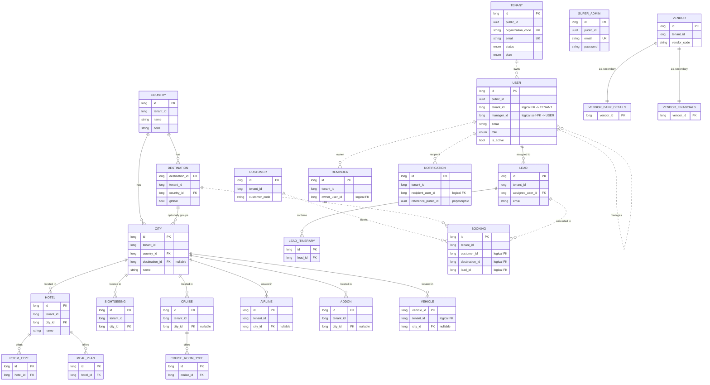

# Travel CRM — Entity Relationship Analysis

> Auto-generated from source (`@Entity` scan of `src/main/java/com/crm/travelcrm/**`).
> 22 concrete entities + 2 mapped-superclasses. PostgreSQL, Hibernate/JPA, multi-tenant.

---

## 1. Scope of the scan

| Kind | Count | Notes |
|------|-------|-------|
| Concrete `@Entity` (tables) | 22 | listed below |
| `@MappedSuperclass` | 2 | `BaseEntity`, `BaseTenantEntity` — no own table |
| `@ElementCollection` tables | 6 | `lead_services`, `booking_services`, `vendor_services`, `reminder_logs`, `hotel_amenities`, `room_type_images` |
| `@SecondaryTable` | 2 | `vendor_bank_details`, `vendor_financials` (1:1 on `vendors.id`) |
| Envers audit tables | 2 | `bookings_aud`, `revinfo` (`Booking` is `@Audited`) |

### Inheritance baseline (applies to every entity that extends it)

- **`BaseEntity`** → `id` (PK, IDENTITY), `public_id` (UUID, unique), `created_by`, `updated_by`, `created_at`, `updated_at`, `deleted_at`, `deleted_by` (soft delete).
- **`BaseTenantEntity` extends BaseEntity** → adds `tenant_id` (NOT NULL). Carries Hibernate `@Filter("tenantFilter")`. **No DB-level FK to `tenants`** — isolation is enforced in the app layer.

---

## 2. Mermaid ER Diagram

> Solid lines = real DB foreign keys (`@ManyToOne` / `@JoinColumn`).
> Dashed lines = logical references enforced only in the application layer (`Long` id columns, **no FK constraint**).

> **Tenant scoping note:** every `BaseTenantEntity` (`User` excepted — it extends `BaseEntity`) carries `tenant_id` that logically references `TENANT.id` with **no** DB FK. Only `TENANT ||..o{ USER` is drawn to avoid 18 identical dashed edges; the same logical relationship applies to `COUNTRY, DESTINATION, CITY, HOTEL, SIGHTSEEING, CRUISE, AIRLINE, ADDON, VEHICLE, LEAD, CUSTOMER, BOOKING, VENDOR, REMINDER, NOTIFICATION`.

---

## 3. Relationship summary table

### 3a. Real foreign keys (DB-enforced)

| Child entity | Table | FK column | → Parent | Cardinality | Optional | Constraint name | On the Java side |
|---|---|---|---|---|---|---|---|
| Destination | `destination_master` | `country_id` | Country | N:1 | no | `fk_destination_country` | `@ManyToOne` |
| City | `cities` | `country_id` | Country | N:1 | no | `fk_city_country` | `@ManyToOne` |
| City | `cities` | `destination_id` | Destination | N:1 | **yes** | `fk_city_destination` | `@ManyToOne(optional)` |
| Hotel | `hotels` | `city_id` | City | N:1 | no | `fk_hotel_city` | `@ManyToOne` |
| RoomType | `hotel_room_types` | `hotel_id` | Hotel | N:1 | no | `fk_room_type_hotel` | `@ManyToOne` |
| MealPlan | `hotel_meal_plans` | `hotel_id` | Hotel | N:1 | no | `fk_meal_plan_hotel` | `@ManyToOne` |
| Sightseeing | `sightseeings` | `city_id` | City | N:1 | no | `fk_sightseeing_city` | `@ManyToOne` |
| Cruise | `cruises` | `city_id` | City | N:1 | **yes** | `fk_cruise_city` | `@ManyToOne` |
| CruiseRoomType | `cruise_room_types` | `cruise_id` | Cruise | N:1 | no | `fk_cruise_room_cruise` | `@ManyToOne` |
| Airline | `airlines` | `city_id` | City | N:1 | **yes** | `fk_airline_city` | `@ManyToOne` |
| Addon | `addons` | `city_id` | City | N:1 | **yes** | `fk_addon_city` | `@ManyToOne` |
| VehicleEntity | `vehicle_master` | `city_id` | City | N:1 | **yes** | `fk_vehicle_city` | `@ManyToOne` |
| Lead | `leads` | `assigned_user_id` | User | N:1 | no | `fk_lead_assigned_user` | `@ManyToOne` |
| LeadItinerary | `lead_itinerary` | `lead_id` | Lead | N:1 | no | (default) | `@ManyToOne` |
| Vendor (bank) | `vendor_bank_details` | `vendor_id` | Vendor | 1:1 | — | `fk_vendor_bank_vendor` | `@SecondaryTable` |
| Vendor (fin.) | `vendor_financials` | `vendor_id` | Vendor | 1:1 | — | `fk_vendor_financials_vendor` | `@SecondaryTable` |

### 3b. Inverse (`@OneToMany`) sides

| Parent | Collection | Child | Cascade / orphanRemoval | Notes |
|---|---|---|---|---|
| Country | `destinations` | Destination | ALL + orphanRemoval | hard cascade delete |
| Country | `cities` | City | ALL + orphanRemoval | hard cascade delete |
| Destination | `cities` | City | none | **detaches** (sets `destination_id = null`) on delete |
| Hotel | `roomTypes` | RoomType | ALL + orphanRemoval | |
| Hotel | `mealPlans` | MealPlan | ALL + orphanRemoval | |
| Cruise | `roomTypes` | CruiseRoomType | ALL + orphanRemoval | |
| Lead | `itinerary` | LeadItinerary | ALL + orphanRemoval | bidirectional |

### 3c. Logical references (application-enforced, **no DB FK**)

| From | Column | → To | Cardinality | Reason |
|---|---|---|---|---|
| Every `BaseTenantEntity` | `tenant_id` | Tenant | N:1 | multi-tenancy by design (filter + listener) |
| User | `tenant_id` | Tenant | N:1 | platform user has NULL |
| User | `manager_id` | User (self) | N:1 | manager→agent hierarchy |
| Booking | `customer_id` | Customer | N:1 | cross-aggregate |
| Booking | `destination_id` | Destination | N:1 | cross-aggregate |
| Booking | `lead_id` | Lead | N:1 | cross-aggregate (lead→booking conversion) |
| Reminder | `owner_user_id` | User | N:1 | SSE routing target |
| Notification | `recipient_user_id` | User | N:1 | feed isolation |
| Notification | `reference_public_id` | *any* | N:1 | **polymorphic** UUID (LEAD/BOOKING/…) |
| VehicleEntity | `tenant_id` | Tenant | N:1 | NULL = global vehicle |

### 3d. Standalone (no outward relationships)

`SuperAdmin`, `Tenant`, `Customer` — leaf/root tables with no JPA association objects.

---

## 4. Findings

### 4.1 Missing foreign keys
All "logical references" in §3c have **no DB constraint**. Most are deliberate (`tenant_id` for multi-tenancy, cross-aggregate ids in DDD style), but these three are the highest-risk because nothing prevents orphan rows:
- `Booking.customer_id`, `Booking.destination_id`, `Booking.lead_id`
- `Reminder.owner_user_id`, `Notification.recipient_user_id`
- `User.manager_id` (self) — a deleted manager leaves dangling `manager_id`.

**Also note:** `Reminder.lead_id` and `Reminder.assign_to` are stored as **free-text strings** (`"LD1042"`, `"U01"`) coming from the frontend — not even logical id references. These cannot be joined or integrity-checked at all.

### 4.2 Circular references
- **Country ↔ City ↔ Destination triangle:** `City → Country` (required), `City → Destination` (optional), `Destination → Country` (required), plus `Country → Destination`. A city's country is therefore reachable two ways (directly, and via its destination). Bidirectional `@OneToMany`/`@ManyToOne` pairs (Country↔Destination, Country↔City, Destination↔City, Lead↔LeadItinerary, Hotel↔RoomType/MealPlan, Cruise↔CruiseRoomType) are managed JPA inverses, not problematic cycles — but watch for JSON serialization loops (use DTOs, which this project already does).
- **User self-reference** (`manager_id`) — a self-cycle; guard against a user being their own/descendant manager in the service layer.

### 4.3 Redundant relationships
- **`City.country_id` is partially redundant** with `City.destination → Destination.country` whenever `destination_id` is set. Risk: the two can disagree. Mitigated only by a service-layer check ("destination's country must equal city's country"); not enforced in schema.
- **`Country.cities` (direct) vs Country→Destination→City** — two navigation paths to the same cities.
- Booking `*_snapshot` columns (`customer_name_snapshot`, `destination_snapshot`) duplicate parent data — **intentional** denormalization for historical accuracy, not a defect.

### 4.4 Normalization / consistency issues
- **`VehicleEntity` is the odd one out:** it does **not** extend `BaseEntity`/`BaseTenantEntity`. It has no `public_id`, no soft-delete, no audit columns, a hand-rolled `tenant_id` + `created_at` + `@PrePersist`. This violates the project rule "always expose `publicId`, never the `Long id`" and breaks tenant-filter uniformity. **Recommend** migrating it to `BaseTenantEntity`.
- **`Vendor.status` / `Vendor.payStatus` are `String`** (`"Active"`, `"Unpaid"`) while comparable fields elsewhere (`Booking.status`, `Customer.status`) are `@Enumerated` enums. Inconsistent; loses type safety.
- **Doc drift:** `CLAUDE.md` states Sightseeing stores `destination`+`city` as **strings (not FK)**, but `Sightseeing` actually has a real `@ManyToOne City` FK (`fk_sightseeing_city`). The code is the source of truth here — update the doc.
- **`@ElementCollection` lists** (`services`, `logs`, `amenities`, `images`) are stored in proper child tables (1NF-compliant) — fine. The comment in `Lead` mentioning "comma-separated" is stale; the mapping is a join table.
- `Booking.active` (boolean) coexists with the inherited `deleted_at` soft-delete — two "is it gone?" flags; pick one to avoid drift.

---

## 5. Draw.io
See `er-diagram.drawio` in this folder (import via *File → Open* in https://app.diagrams.net).
