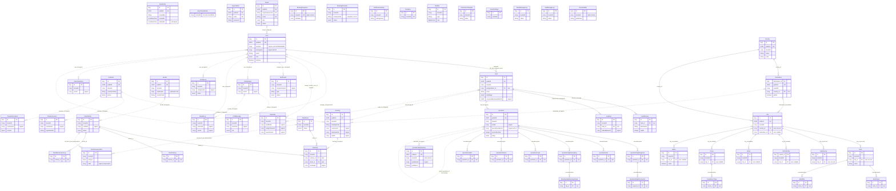

# Travel CRM ER Diagram

## Overview

Multi-tenant Travel CRM (Spring Boot 3.5 / Java 21 / PostgreSQL) modelled as **56 `@Entity` classes** over two `@MappedSuperclass` bases. Most entities extend `BaseTenantEntity` (`id` + `publicId` UUID + audit + soft-delete + Hibernate `tenantFilter`); a handful extend `BaseEntity` (child rows reached only through a parent) and three are standalone plain `@Entity` rows. **Cross-aggregate references are deliberately *logical* FKs** (a plain `Long`/`UUID` column, no DB constraint, validated tenant-scoped in the service); **real JPA `@ManyToOne`/`@OneToMany` associations exist only *within* an aggregate or bounded context.** This document is generated from the entity classes themselves — where it disagrees with `CLAUDE.md`, the code is authoritative.

## Entity Summary

| Entity | Table | Primary Key | Description |
|--------|-------|-------------|-------------|
| `BaseEntity` *(mapped superclass)* | — | `id` (long, IDENTITY) + `public_id` (UUID) | Shared identity, audit (`created/updated/deletedBy`+timestamps), soft-delete via `deletedAt`. |
| `BaseTenantEntity` *(mapped superclass)* | — | inherits `BaseEntity` | Adds `tenant_id` (not-null, not-updatable) + `@FilterDef` `tenantFilter` / `softDeleteFilter`. |
| `SuperAdmin` | `super_admins` | `id` + `publicId` | Platform admin, `UserDetails`; no tenant. |
| `Tenant` | `tenants` | `id` + `publicId` | Tenant organisation record (`BaseEntity`, platform-level). |
| `User` | `users` | `id` + `publicId` | Staff user, `UserDetails`. `BaseEntity` **+ a `tenant_id` column** (not tenant-filtered). `managerId` self-reference. |
| `Lead` | `leads` | `id` + `publicId` | Lead pipeline record; real FK to `User` (assigned), owns itinerary. |
| `LeadItinerary` | `lead_itinerary` | `id` + `publicId` | Itinerary leg of a lead (`BaseEntity`, reached via `Lead`). |
| `LeadLog` | `lead_logs` | `id` + `publicId` | Activity-log entry on a lead. |
| `Quotation` | `quotations` | `id` + `publicId` | Quotation aggregate root; 6 child collections + 5 element collections; self-versioning. |
| `QuotationFlightSegment` | `quotation_flight_segments` | `id` + `publicId` | Flight leg of a quotation (`BaseEntity`). |
| `QuotationFlightConnection` | `quotation_flight_connections` | `id` + `publicId` | Connecting flight under a segment (`BaseEntity`). |
| `QuotationHotel` | `quotation_hotels` | `id` + `publicId` | Hotel line item (`BaseEntity`). |
| `QuotationSightseeingDay` | `quotation_sightseeing_days` | `id` + `publicId` | Sightseeing day (`BaseEntity`). |
| `QuotationSightseeingActivity` | `quotation_sightseeing_activities` | `id` + `publicId` | Activity under a day (`BaseEntity`); element collection of meals. |
| `QuotationCruise` | `quotation_cruises` | `id` + `publicId` | Cruise line item (`BaseEntity`). |
| `QuotationVehicle` | `quotation_vehicles` | `id` + `publicId` | Vehicle/transfer line item (`BaseEntity`). |
| `QuotationAddon` | `quotation_addons` | `id` + `publicId` | Add-on line item (`BaseEntity`). |
| `QuotationWeblinkView` | `quotation_weblink_view` | `id` (Long) + `publicId` | **Standalone** analytics upsert per (tenant, quotation, IP). No base class. |
| `Booking` | `bookings` (+ `bookings_aud`) | `id` + `publicId` | Booking; `@Audited` (Envers). All references logical. |
| `BookingSequence` | `booking_sequences` | `id` (Long) | **Standalone** per-tenant counter for `BKG-YY-NNNN`. No `publicId`/audit. |
| `BookingReminder` | `booking_reminders` | `id` + `publicId` | Booking follow-up reminder (free-text booking snapshot, no FK). |
| `Reminder` | `reminders` | `id` + `publicId` | CRM follow-up reminder; logical refs to lead/user; element collection of logs. |
| `Notification` | `notifications` | `id` + `publicId` | In-app notification, one row per (event, recipient). |
| `NotificationSetting` | `notification_settings` | `id` + `publicId` | Org-wide auto-reminder config (JSON), one row per tenant. |
| `Customer` | `customers` | `id` + `publicId` | Customer master (profile only; metrics computed from `bookings`). |
| `Vendor` | `vendors` (+ `vendor_bank_details`, `vendor_financials`) | `id` + `publicId` | Vendor master; `@SecondaryTable` split; `@Version` optimistic lock. |
| `Country` | `countries` | `id` + `publicId` | Geography root; owns destinations + cities. |
| `Destination` | `destination_master` | `destination_id` (renamed `id`) + `publicId` | Destination under a country; `global` flag. |
| `City` | `cities` | `id` + `publicId` | City; required country FK + optional destination FK. |
| `Hotel` | `hotels` | `id` + `publicId` | Hotel master; real City FK; owns room types + meal plans. |
| `RoomType` | `hotel_room_types` | `id` + `publicId` | Room type under a hotel (`BaseEntity`); element collection of images. |
| `MealPlan` | `hotel_meal_plans` | `id` + `publicId` | Meal plan under a hotel (`BaseEntity`). |
| `Sightseeing` | `sightseeings` | `id` + `publicId` | Sightseeing master; real City FK. |
| `VehicleEntity` | `vehicle_master` | `vehicle_id` (renamed `id`) + `publicId` | Vehicle master; optional City FK; `global` = null tenant. |
| `Airline` | `airlines` | `id` + `publicId` | Airline master; optional City FK. |
| `Cruise` | `cruises` | `id` + `publicId` | Cruise master; optional City FK; owns cruise room types. |
| `CruiseRoomType` | `cruise_room_types` | `id` + `publicId` | Room type under a cruise (`BaseEntity`). |
| `Addon` | `addons` | `id` + `publicId` | Add-on service master; optional City FK. |
| `FleetVehicle` | `fleet_vehicles` | `id` + `publicId` | Operational fleet vehicle (Vehicle Diary); logical vendor ref. |
| `FleetDriver` | `fleet_drivers` | `id` + `publicId` | Fleet driver (not a `User`). |
| `FleetTrip` | `fleet_trips` | `id` + `publicId` | Diary trip; real FKs to vehicle + driver; logical booking ref. |
| `FleetFuelLog` | `fleet_fuel_logs` | `id` + `publicId` | Fuel fill-up; real FK to fleet vehicle. |
| `FleetMaintenanceLog` | `fleet_maintenance_logs` | `id` + `publicId` | Service record; real FK to fleet vehicle. |
| `FleetDocumentAlert` | `fleet_document_alerts` | `id` + `publicId` | Fired document-expiry alert; polymorphic logical ref (vehicle/driver). |
| `TravelerAccount` | `traveler_accounts` | `id` + `publicId` | Portal (traveler) auth identity; logical Customer ref; OTP login. |
| `TravelerDocument` | `traveler_documents` | `id` + `publicId` | Traveler PII document (`bytea` blob); logical Customer ref. |
| `ChatSession` | `ai_chat_sessions` | `id` + `publicId` | AI (Disha) conversation owned by a user (logical). |
| `ChatMessage` | `ai_chat_messages` | `id` + `publicId` | One turn in a chat session (logical `sessionId`). |
| `AiAuditLog` | `ai_audit_logs` | `id` + `publicId` | Immutable AI tool-call audit trail. |
| `ActivityLog` | `activity_logs` | `id` + `publicId` | Audit trail (who/what/when/where); logical user ref + snapshots. |
| `Company` | `companies` | `id` + `publicId` | Editable org profile, one row per tenant. |
| `TaxRate` | `tax_rates` | `id` + `publicId` | Tenant GST/TCS rate with effective-date range. |
| `PermissionTemplate` | `permission_templates` | `id` + `publicId` | Reusable per-tenant permission map (JSON). |
| `UserPermission` | `user_permissions` | `id` + `publicId` | Per-(tenant,user) permission map (JSON); logical user ref. |
| `TenantSettings` | `tenant_settings` | `id` + `publicId` | Per-tenant SMTP/WhatsApp integration secrets (AES). |
| `EmailMessageLog` | `email_logs` | `id` + `publicId` | Append-only email send log. |
| `WaMessageLog` | `whatsapp_logs` | `id` + `publicId` | Append-only WhatsApp send log. |
| `TenantStaffIp` | `tenant_staff_ip` | `id` (Long) | **Standalone** tenant "home IP" set. No base class. |

## Core Relationships

Legend: `1 ---- *` = one-to-many. **[real]** = an actual JPA `@ManyToOne`/`@OneToMany` (DB-level FK). **[logical]** = a plain column reference (no DB FK, validated in the service). `(opt)` = nullable/optional side.

### Real (JPA-mapped) associations

```
User               1 ---- *   Lead                          [real] assigned_user_id (fk_lead_assigned_user); inverse NOT mapped on User
Lead               1 ---- *   LeadItinerary                 [real] lead_id — cascade ALL, orphanRemoval
Lead               1 ---- *   LeadLog                       [real] lead_id (fk_lead_log_lead); inverse NOT mapped on Lead

Quotation          1 ---- *   QuotationFlightSegment        [real] cascade ALL, orphanRemoval
QuotationFlightSegment 1 -- * QuotationFlightConnection     [real] segment_id — cascade ALL, orphanRemoval
Quotation          1 ---- *   QuotationHotel                [real] cascade ALL, orphanRemoval
Quotation          1 ---- *   QuotationSightseeingDay       [real] cascade ALL, orphanRemoval
QuotationSightseeingDay 1 - * QuotationSightseeingActivity  [real] day_id — cascade ALL, orphanRemoval
Quotation          1 ---- *   QuotationCruise               [real] cascade ALL, orphanRemoval
Quotation          1 ---- *   QuotationVehicle              [real] cascade ALL, orphanRemoval
Quotation          1 ---- *   QuotationAddon                [real] cascade ALL, orphanRemoval

Country            1 ---- *   Destination                   [real] country_id (fk_destination_country); inverse read-only, no cascade
Country            1 ---- *   City                          [real] country_id (fk_city_country); inverse read-only, no cascade
Destination     (opt)1 ---- * City                          [real] destination_id (fk_city_destination), nullable; inverse read-only, detach-on-delete

City               1 ---- *   Hotel                         [real] city_id (fk_hotel_city), NOT NULL
City               1 ---- *   Sightseeing                   [real] city_id (fk_sightseeing_city), NOT NULL
City            (opt)1 ---- * VehicleEntity                 [real] city_id (fk_vehicle_city), nullable
City            (opt)1 ---- * Airline                       [real] city_id (fk_airline_city), nullable
City            (opt)1 ---- * Cruise                        [real] city_id (fk_cruise_city), nullable
City            (opt)1 ---- * Addon                         [real] city_id (fk_addon_city), nullable

Hotel              1 ---- *   RoomType                      [real] hotel_id — cascade ALL, orphanRemoval
Hotel              1 ---- *   MealPlan                      [real] hotel_id — cascade ALL, orphanRemoval
Cruise             1 ---- *   CruiseRoomType                [real] cruise_id — cascade ALL, orphanRemoval

FleetVehicle       1 ---- *   FleetTrip                     [real] vehicle_id (fk_fleet_trip_vehicle), NOT NULL
FleetDriver        1 ---- *   FleetTrip                     [real] driver_id (fk_fleet_trip_driver), NOT NULL
FleetVehicle       1 ---- *   FleetFuelLog                  [real] vehicle_id (fk_fleet_fuel_vehicle), NOT NULL
FleetVehicle       1 ---- *   FleetMaintenanceLog           [real] vehicle_id (fk_fleet_maint_vehicle), NOT NULL
```

### Logical (cross-aggregate) references — no DB FK

```
Tenant          (opt)1 ---- * User                          [logical] users.tenant_id (null = SUPERADMIN)
User            (opt)1 ---- * User                          [logical] manager_id self-reference (TRAVEL_AGENT → MANAGER)
Lead            (opt)1 ---- * Quotation                     [logical] quotations.lead_id (+ lead_public_id snapshot)
Quotation       (opt)1 ---- * Quotation                     [logical] parent_quotation_id self-ref (versioning tree)
Customer           1 ---- *   Booking                       [logical] bookings.customer_id
Lead            (opt)1 ---- * Booking                       [logical] bookings.lead_id (+ source_lead_public_id)
Destination     (opt)1 ---- * Booking                       [logical] bookings.destination_id
Quotation          1 ---- *   QuotationWeblinkView          [logical] quotation_weblink_view.quotation_id
Lead            (opt)1 ---- * Reminder                      [logical] reminders.lead_id_ref (+ lead_public_id)
User            (opt)1 ---- * Reminder                      [logical] assign_to_user_id / owner_user_id
User               1 ---- *   Notification                  [logical] recipient_user_id
User               1 ---- *   ChatSession                   [logical] ai_chat_sessions.user_id
ChatSession        1 ---- *   ChatMessage                   [logical] ai_chat_messages.session_id
ChatSession     (opt)1 ---- * AiAuditLog                    [logical] ai_audit_logs.session_id (nullable) + user_id
User               1 ---- *   ActivityLog                   [logical] activity_logs.user_id (+ name/email/type snapshots)
Customer           1 ---- *   TravelerAccount               [logical] customer_id (unique per tenant)
Customer           1 ---- *   TravelerDocument              [logical] customer_id (ownership key)
Vendor          (opt)1 ---- * FleetVehicle                  [logical] fleet_vehicles.vendor_id (+ snapshots)
Booking         (opt)1 ---- * FleetTrip                     [logical] fleet_trips.booking_id (+ code snapshot)
FleetVehicle/FleetDriver 1 - * FleetDocumentAlert           [logical] ref_id + ref_type (polymorphic)
User               1 ---- *   UserPermission                [logical] user_permissions.user_id (unique per tenant)
Lead            (opt)1 ---- 1 Booking                       [logical] leads.converted_booking_public_id (on conversion)
```

*Snapshot-only (no association at all):* `BookingReminder` stores `booking_code`/`customer_name` as free text (any reference the FE supplies). `Company`, `TaxRate`, `TenantSettings`, `EmailMessageLog`, `WaMessageLog`, `NotificationSetting`, `PermissionTemplate`, `SuperAdmin`, `Tenant`, `BookingSequence`, `TenantStaffIp` have no outward entity references.

## Mermaid ER Diagram

Solid lines (`--`) are real JPA/DB foreign keys; dashed lines (`..`) are logical cross-aggregate references (no DB constraint).


```mermaid
erDiagram
    %% ─────────── Mapped superclasses (not tables) ───────────
    BaseEntity {
        long id PK
        UUID publicId UK
        String createdBy
        LocalDateTime createdAt
        LocalDateTime deletedAt "soft delete"
    }
    BaseTenantEntity {
        Long tenantId "not-null, tenantFilter"
    }

    %% ─────────── Platform / Auth ───────────
    SuperAdmin {
        long id PK
        UUID publicId UK
        String email UK
        String password
    }
    Tenant {
        long id PK
        UUID publicId UK
        String organizationCode UK
        String email UK
        enum plan
        enum status
    }
    User {
        long id PK
        UUID publicId UK
        Long tenantId "logical, null=SUPERADMIN"
        Long managerId "logical self-ref"
        String email
        enum role
        Boolean isActive
    }

    %% ─────────── Lead pipeline ───────────
    Lead {
        long id PK
        UUID publicId UK
        Long tenantId
        Long assignedUser_id FK "real"
        String email
        enum leadStage
        UUID convertedBookingPublicId "logical"
    }
    LeadItinerary {
        long id PK
        Long lead_id FK "real"
        String destination
        Integer nights
    }
    LeadLog {
        long id PK
        Long tenantId
        Long lead_id FK "real"
        Long addedByUserId "logical"
    }

    %% ─────────── Quotation aggregate ───────────
    Quotation {
        long id PK
        UUID publicId UK
        Long tenantId
        Long leadId "logical"
        Long parentQuotationId "logical self-ref"
        Integer versionNumber
        enum stage
    }
    QuotationFlightSegment {
        long id PK
        Long quotation_id FK "real"
    }
    QuotationFlightConnection {
        long id PK
        Long segment_id FK "real"
    }
    QuotationHotel {
        long id PK
        Long quotation_id FK "real"
    }
    QuotationSightseeingDay {
        long id PK
        Long quotation_id FK "real"
    }
    QuotationSightseeingActivity {
        long id PK
        Long day_id FK "real"
    }
    QuotationCruise {
        long id PK
        Long quotation_id FK "real"
    }
    QuotationVehicle {
        long id PK
        Long quotation_id FK "real"
    }
    QuotationAddon {
        long id PK
        Long quotation_id FK "real"
    }
    QuotationWeblinkView {
        Long id PK
        UUID publicId UK
        Long tenantId "plain column"
        Long quotationId "logical"
        String ipAddress
    }

    %% ─────────── Booking ───────────
    Booking {
        long id PK
        UUID publicId UK
        Long tenantId
        String bookingCode
        Long customerId "logical"
        Long destinationId "logical"
        Long leadId "logical"
    }
    BookingSequence {
        Long id PK
        Long tenantId UK "plain column"
        Long lastValue
    }
    BookingReminder {
        long id PK
        Long tenantId
        String bookingCode "snapshot, no FK"
        enum status
    }

    %% ─────────── Reminders / Notifications ───────────
    Reminder {
        long id PK
        Long tenantId
        Long leadRefId "logical"
        Long assignToUserId "logical"
        Long ownerUserId "logical"
    }
    Notification {
        long id PK
        Long tenantId
        Long recipientUserId "logical"
        String type
        enum status
    }
    NotificationSetting {
        long id PK
        Long tenantId UK
        String settingsJson
    }

    %% ─────────── Customer / Vendor ───────────
    Customer {
        long id PK
        UUID publicId UK
        Long tenantId
        String customerCode
        String phone
    }
    Vendor {
        long id PK
        UUID publicId UK
        Long tenantId
        Long rowVersion "optimistic lock"
        String vendorCode
    }

    %% ─────────── Geography ───────────
    Country {
        long id PK
        UUID publicId UK
        Long tenantId
        String name
        String code
    }
    Destination {
        long destination_id PK
        UUID publicId UK
        Long tenantId
        Long country_id FK "real"
        boolean global
    }
    City {
        long id PK
        UUID publicId UK
        Long tenantId
        Long country_id FK "real, not-null"
        Long destination_id FK "real, nullable"
    }

    %% ─────────── Masters ───────────
    Hotel {
        long id PK
        Long tenantId
        Long city_id FK "real, not-null"
        String name
    }
    RoomType {
        long id PK
        Long hotel_id FK "real"
    }
    MealPlan {
        long id PK
        Long hotel_id FK "real"
    }
    Sightseeing {
        long id PK
        Long tenantId
        Long city_id FK "real, not-null"
    }
    VehicleEntity {
        long vehicle_id PK
        Long tenantId
        Long city_id FK "real, nullable"
    }
    Airline {
        long id PK
        Long tenantId
        Long city_id FK "real, nullable"
    }
    Cruise {
        long id PK
        Long tenantId
        Long city_id FK "real, nullable"
    }
    CruiseRoomType {
        long id PK
        Long cruise_id FK "real"
    }
    Addon {
        long id PK
        Long tenantId
        Long city_id FK "real, nullable"
        boolean active
    }

    %% ─────────── Fleet (Vehicle Diary) ───────────
    FleetVehicle {
        long id PK
        Long tenantId
        Long vendorId "logical"
        enum status
    }
    FleetDriver {
        long id PK
        Long tenantId
        enum status
    }
    FleetTrip {
        long id PK
        Long tenantId
        Long vehicle_id FK "real"
        Long driver_id FK "real"
        Long bookingId "logical"
    }
    FleetFuelLog {
        long id PK
        Long vehicle_id FK "real"
    }
    FleetMaintenanceLog {
        long id PK
        Long vehicle_id FK "real"
    }
    FleetDocumentAlert {
        long id PK
        Long tenantId
        enum refType
        Long refId "logical, polymorphic"
    }

    %% ─────────── Portal ───────────
    TravelerAccount {
        long id PK
        Long tenantId
        Long customerId "logical"
        String loginIdentifier
    }
    TravelerDocument {
        long id PK
        Long tenantId
        Long customerId "logical"
        bytea content
    }

    %% ─────────── AI (Disha) / Activity ───────────
    ChatSession {
        long id PK
        Long tenantId
        Long userId "logical"
    }
    ChatMessage {
        long id PK
        Long tenantId
        Long sessionId "logical"
        enum role
    }
    AiAuditLog {
        long id PK
        Long tenantId
        Long sessionId "logical"
        Long userId "logical"
    }
    ActivityLog {
        long id PK
        Long tenantId
        Long actingUserId "logical"
        enum action
    }

    %% ─────────── Company / Settings / Permissions ───────────
    Company {
        long id PK
        Long tenantId UK
    }
    TaxRate {
        long id PK
        Long tenantId
        String type
        BigDecimal rate
    }
    PermissionTemplate {
        long id PK
        Long tenantId
        String value
    }
    UserPermission {
        long id PK
        Long tenantId
        Long userId "logical"
    }
    TenantSettings {
        long id PK
        Long tenantId
    }
    EmailMessageLog {
        long id PK
        Long tenantId
        String status
    }
    WaMessageLog {
        long id PK
        Long tenantId
        String status
    }
    TenantStaffIp {
        Long id PK
        Long tenantId "plain column"
        String ipAddress
    }

    %% ═══════════ Real JPA associations (solid) ═══════════
    User ||--o{ Lead : "assigned (fk_lead_assigned_user)"
    Lead ||--o{ LeadItinerary : "itinerary (cascade)"
    Lead ||--o{ LeadLog : "logs (inverse unmapped)"

    Quotation ||--o{ QuotationFlightSegment : "cascade/orphan"
    QuotationFlightSegment ||--o{ QuotationFlightConnection : "cascade/orphan"
    Quotation ||--o{ QuotationHotel : "cascade/orphan"
    Quotation ||--o{ QuotationSightseeingDay : "cascade/orphan"
    QuotationSightseeingDay ||--o{ QuotationSightseeingActivity : "cascade/orphan"
    Quotation ||--o{ QuotationCruise : "cascade/orphan"
    Quotation ||--o{ QuotationVehicle : "cascade/orphan"
    Quotation ||--o{ QuotationAddon : "cascade/orphan"

    Country ||--o{ Destination : "country_id"
    Country ||--o{ City : "country_id"
    Destination |o--o{ City : "destination_id (nullable)"
    City ||--o{ Hotel : "city_id (not-null)"
    City ||--o{ Sightseeing : "city_id (not-null)"
    City |o--o{ VehicleEntity : "city_id (nullable)"
    City |o--o{ Airline : "city_id (nullable)"
    City |o--o{ Cruise : "city_id (nullable)"
    City |o--o{ Addon : "city_id (nullable)"
    Hotel ||--o{ RoomType : "cascade/orphan"
    Hotel ||--o{ MealPlan : "cascade/orphan"
    Cruise ||--o{ CruiseRoomType : "cascade/orphan"

    FleetVehicle ||--o{ FleetTrip : "vehicle_id"
    FleetDriver ||--o{ FleetTrip : "driver_id"
    FleetVehicle ||--o{ FleetFuelLog : "vehicle_id"
    FleetVehicle ||--o{ FleetMaintenanceLog : "vehicle_id"

    %% ═══════════ Logical cross-aggregate references (dashed) ═══════════
    Tenant |o..o{ User : "tenant_id (logical)"
    User |o..o{ User : "manager_id (logical self)"
    Lead |o..o{ Quotation : "lead_id (logical)"
    Quotation |o..o{ Quotation : "parent_quotation_id (versioning)"
    Customer ||..o{ Booking : "customer_id (logical)"
    Lead |o..o{ Booking : "lead_id (logical)"
    Destination |o..o{ Booking : "destination_id (logical)"
    Quotation ||..o{ QuotationWeblinkView : "quotation_id (logical)"
    Lead |o..o{ Reminder : "lead_id_ref (logical)"
    User |o..o{ Reminder : "assign_to/owner_user_id (logical)"
    User ||..o{ Notification : "recipient_user_id (logical)"
    User ||..o{ ChatSession : "user_id (logical)"
    ChatSession ||..o{ ChatMessage : "session_id (logical)"
    ChatSession |o..o{ AiAuditLog : "session_id (logical)"
    User |o..o{ AiAuditLog : "user_id (logical)"
    User |o..o{ ActivityLog : "user_id (logical)"
    Customer ||..o{ TravelerAccount : "customer_id (logical)"
    Customer ||..o{ TravelerDocument : "customer_id (logical)"
    Vendor |o..o{ FleetVehicle : "vendor_id (logical)"
    Booking |o..o{ FleetTrip : "booking_id (logical)"
    FleetVehicle |o..o{ FleetDocumentAlert : "ref_id+ref_type (polymorphic)"
    FleetDriver |o..o{ FleetDocumentAlert : "ref_id+ref_type (polymorphic)"
    User ||..o{ UserPermission : "user_id (logical)"
```

## Design Notes & Recommendations

*Documentation only — these are observations from the entity classes, not changes to make.*

- **Doc drift — `Hotel` now uses a real `@ManyToOne City` FK.** The entity maps `city_id` (`fk_hotel_city`, not-null), but `CLAUDE.md` still describes Hotel as storing `destinationId (Long) + city (String)`. The code is authoritative; the CLAUDE.md master-hierarchy table is stale on this point. `Airline`, `Cruise`, `VehicleEntity`, and `Addon` have likewise each gained an **optional** `City` FK, though CLAUDE.md still calls them "flat".

- **`Lead.services` is the only `EAGER` collection.** `@ElementCollection(fetch = EAGER)` on `lead_services` issues a separate select per `Lead`; in list/Kanban/pipeline views that materialise many leads this is an N+1 pattern (partly mitigated by `@BatchSize(50)`, but still eager on every load and not covered by an `@EntityGraph`). Every other element collection in the codebase is `LAZY`. Consider making it `LAZY` + an explicit fetch/`@EntityGraph` where the full service list is actually needed.

- **No `EAGER` `@ManyToOne` anywhere** — all `@ManyToOne` associations are `FetchType.LAZY`, so the classic eager-join N+1 is avoided. The remaining N+1 exposure is: (a) `Lead.services` above, and (b) list endpoints that touch lazy associations without a fetch-join (e.g. `FleetTrip → vehicle/driver` names, `Hotel → city`) — these rely on `@BatchSize` rather than `@EntityGraph`.

- **Cross-aggregate integrity is application-enforced, not DB-enforced.** `Booking` (customerId/destinationId/leadId), `Reminder`, `Notification`, `Quotation.leadId`, `TravelerAccount`/`TravelerDocument.customerId`, `ChatMessage.sessionId`, `FleetVehicle.vendorId`, `FleetTrip.bookingId`, `UserPermission.userId`, etc. are plain columns with **no DB foreign key**. A missing/cross-tenant target only fails if the service does the tenant-scoped check — there is no referential safety net at the schema level, and `findById(Long)` bypasses the tenant filter (see `CLAUDE.md`). This is a deliberate, consistent convention, but worth stating as the single biggest integrity risk surface.

- **`User` is tenant-scoped but extends `BaseEntity`, not `BaseTenantEntity`.** It carries a `tenant_id` column yet does **not** get the Hibernate `tenantFilter`. Every `User` lookup must therefore use an explicit `...AndTenantId(...)` finder; a bare `findById`/`getReferenceById` reads across tenants. Same caution applies to `Lead.assignedUser` — the only real FK that crosses into the `User` aggregate.

- **Three standalone entities carry `tenant_id` without the tenant filter:** `BookingSequence`, `TenantStaffIp`, and `QuotationWeblinkView` are plain `@Entity` classes (no `publicId`/audit/soft-delete on the first two; `QuotationWeblinkView` has its own `publicId`). Each is isolated only by explicitly keying every query on `tenant_id` (backed by unique constraints). This is intentional (the public/locked-read write paths have no `TenantContext`), but it means tenant isolation for these three depends entirely on query discipline.

- **Self-referencing FKs are logical, not mapped associations.** `Quotation.parentQuotationId` (version tree) and `User.managerId` (agent→manager) are plain `Long` columns — no `@ManyToOne`, so no cascade, no orphan handling, and no DB FK. Traversing a version family or a management chain is a manual, service-level query. `Quotation.versionNumber` + `parentQuotationId` together model the versioning tree with the root's `parentQuotationId = null`.

- **Intentional one-directional (missing inverse) associations.** `User` has no `@OneToMany` back to `Lead` (documented: counts come from aggregate queries, never a materialised list). `Lead` has no inverse collection for `LeadLog`. `City` exposes no inverse collections for the six masters that point at it (`Hotel`, `Sightseeing`, `VehicleEntity`, `Airline`, `Cruise`, `Addon`). `Country`/`Destination` **do** keep read-only inverse `cities`/`destinations` collections (no cascade). These are deliberate and correct, but the asymmetry is worth knowing when reasoning about lazy-loading.

- **Cascade / hard-delete asymmetry in geography vs quotation/hotel/cruise.** Quotation children, `Hotel→RoomType/MealPlan`, and `Cruise→CruiseRoomType` use `cascade = ALL, orphanRemoval = true` (hard child lifecycle). `Country→Destination/City` and `Destination→City` are deliberately **read-only inverses with no cascade** — geography uses soft-delete + `MasterReferenceGuard` + the Trash purge instead, so deleting/purging a parent never silently hard-deletes a restored child. Correct by design; just a non-uniform pattern to be aware of.

- **`FleetDocumentAlert` is a polymorphic logical reference.** `ref_type` (VEHICLE/DRIVER enum) + `ref_id` point at either `FleetVehicle` or `FleetDriver` with no FK — a single column pair standing in for two possible parents. The Mermaid diagram shows both edges; only one is populated per row.

- **`Vendor` maps one entity across three tables** (`@SecondaryTable` for `vendor_bank_details` + `vendor_financials`) and is the only entity with a JPA `@Version` optimistic lock (`row_version`). Loading a `Vendor` joins both secondary tables; list views should use a projection (per `CLAUDE.md`).

- **`Booking` is the only `@Audited` (Envers) entity** — generates `bookings_aud` + `revinfo`. Its `services` `@ElementCollection` is `@NotAudited`.

- **`Destination` and `VehicleEntity` rename the inherited PK column** via `@AttributeOverride(name = "id", column = @Column(name = "destination_id" / "vehicle_id"))`. The PK is still the single inherited `BaseEntity.id`; only the column name differs, so joins/finders must use those column names.

- **No obviously dead entities.** All 56 entities resolve to a repository/service (fleet, quotation-children via cascade, message/audit logs written best-effort). `RoomType.images` / `Hotel.amenities` element collections are the lightest-used but still mapped. Nothing here reads as orphaned schema.