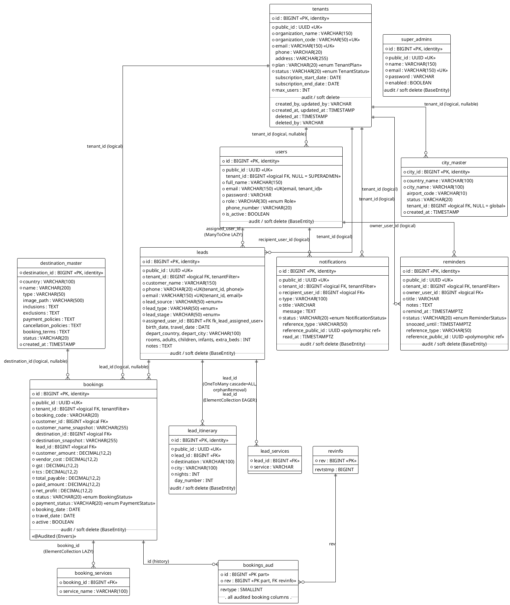

# Entity-Relationship Documentation — Travel CRM Backend

> Generated from a full scan of `src/main/java` (JPA annotations only — the schema is auto-managed via `spring.jpa.hibernate.ddl-auto=update`).
>
> **Scope:** 10 `@Entity` classes, 2 `@MappedSuperclass` classes, 0 `@Embeddable` types, 2 `@ElementCollection` join tables, plus 2 Hibernate Envers audit tables generated for `Booking`.

---

## 1. Complete ERD Description

### 1.1 Mapped superclasses (inherited columns)

#### `BaseEntity` (`@MappedSuperclass`) — `common/entity/BaseEntity.java`

Inherited by every entity below **except** `CityMasterEntity` and `DestinationMasterEntity`.

| Column | Java type | Constraints | Notes |
|---|---|---|---|
| `id` | `long` | **PK**, `IDENTITY` | Internal — never exposed in APIs |
| `public_id` | `UUID` | NOT NULL, UNIQUE, non-updatable | `@UuidGenerator`; external-facing ID |
| `created_by` | `String` | non-updatable | `@CreatedBy` via Spring auditing |
| `updated_by` | `String` | — | `@LastModifiedBy` |
| `created_at` | `LocalDateTime` | NOT NULL, non-updatable | `@CreatedDate` |
| `updated_at` | `LocalDateTime` | NOT NULL | `@LastModifiedDate` |
| `deleted_at` | `LocalDateTime` | nullable | Soft delete marker |
| `deleted_by` | `String` | nullable | Soft delete actor |

#### `BaseTenantEntity` (`@MappedSuperclass`, extends `BaseEntity`) — `common/entity/BaseTenantEntity.java`

Adds tenant isolation. Carries `@FilterDef`/`@Filter("tenantFilter", condition = "tenant_id = :tenantId")` and `TenantEntityListener` (`@PrePersist`/`@PreUpdate` stamping from `TenantContext`).

| Column | Java type | Constraints | Notes |
|---|---|---|---|
| `tenant_id` | `Long` | NOT NULL, non-updatable | **Logical FK** to `tenants.id` (no DB-level FK constraint) |

### 1.2 Entities

#### `Tenant` → table `tenants` (extends `BaseEntity`)

| Column | Java type | Constraints |
|---|---|---|
| *(inherited)* | — | All `BaseEntity` columns |
| `organization_name` | `String(150)` | NOT NULL |
| `organization_code` | `String(50)` | NOT NULL, UNIQUE (used for subdomains) |
| `email` | `String(150)` | NOT NULL, UNIQUE |
| `phone` | `String(20)` | — |
| `address` | `String(255)` | — |
| `plan` | `TenantPlan` enum (STRING, 20) | NOT NULL, default `STARTER` |
| `status` | `TenantStatus` enum (STRING, 20) | NOT NULL, default `ACTIVE` |
| `subscription_start_date` | `LocalDate` | — |
| `subscription_end_date` | `LocalDate` | — |
| `max_users` | `Integer` | NOT NULL, default 5 |

Indexes: `idx_tenant_email (email)`, `idx_tenant_organization_code (organization_code)`.

#### `SuperAdmin` → table `super_admins` (extends `BaseEntity`, implements `UserDetails`)

| Column | Java type | Constraints |
|---|---|---|
| *(inherited)* | — | All `BaseEntity` columns |
| `name` | `String(150)` | NOT NULL |
| `email` | `String(150)` | NOT NULL, UNIQUE |
| `password` | `String` | NOT NULL |
| `enabled` | `Boolean` | NOT NULL, default `true` |

#### `User` → table `users` (extends `BaseEntity`, implements `UserDetails`)

| Column | Java type | Constraints |
|---|---|---|
| *(inherited)* | — | All `BaseEntity` columns |
| `tenant_id` | `Long` | nullable — **NULL = platform-level SUPERADMIN**; logical FK to `tenants.id` |
| `full_name` | `String(150)` | NOT NULL |
| `email` | `String(150)` | NOT NULL (unique *per tenant*, not globally) |
| `password` | `String` | NOT NULL |
| `role` | `Role` enum (STRING, 30) | NOT NULL |
| `phone_number` | `String(20)` | — |
| `is_active` | `Boolean` | NOT NULL, default `true` |

Unique constraint: `uq_user_email_tenant (email, tenant_id)`.
Indexes: `idx_user_email (email)`, `idx_user_tenant (tenant_id)`, `idx_user_role (role)`.
Deliberately **no** `@OneToMany(mappedBy = "assignedUser")` back-reference — lead counts come from aggregate queries.

#### `Lead` → table `leads` (extends `BaseTenantEntity`)

| Column | Java type | Constraints |
|---|---|---|
| *(inherited)* | — | All `BaseEntity` + `tenant_id` (NOT NULL) |
| `customer_name` | `String(150)` | NOT NULL |
| `phone` | `String(20)` | NOT NULL |
| `email` | `String(150)` | NOT NULL |
| `lead_source` | `LeadSource` enum (STRING, 50) | NOT NULL |
| `lead_type` | `LeadType` enum (STRING, 50) | NOT NULL |
| `lead_stage` | `LeadStage` enum (STRING, 50) | NOT NULL |
| `assigned_user_id` | FK → `users.id` | NOT NULL, `@ManyToOne(LAZY, optional=false)`, FK `fk_lead_assigned_user` |
| `birth_date` | `LocalDate` | — |
| `travel_date` | `LocalDate` | — |
| `depart_country` | `String(100)` | — |
| `depart_city` | `String(100)` | — |
| `rooms`, `adults`, `children`, `infants`, `extra_beds` | `Integer` | — |
| `notes` | `TEXT` | — |

Collections:
- `services` — `@ElementCollection(EAGER)` → table `lead_services` (`lead_id` FK, `service` value column), `@BatchSize(50)`.
- `itinerary` — `@OneToMany(mappedBy = "lead", cascade = ALL, orphanRemoval = true, LAZY)`, `@BatchSize(50)`.

Unique constraints: `uk_lead_tenant_email (tenant_id, email)`, `uk_lead_tenant_phone (tenant_id, phone)`.
Indexes: `idx_lead_email (email)`, `idx_lead_phone (phone)`.

#### `LeadItinerary` → table `lead_itinerary` (extends `BaseEntity` — **not** tenant-scoped; always reached via parent `Lead`)

| Column | Java type | Constraints |
|---|---|---|
| *(inherited)* | — | All `BaseEntity` columns |
| `lead_id` | FK → `leads.id` | NOT NULL, `@ManyToOne(LAZY, optional=false)` |
| `destination` | `String(100)` | NOT NULL |
| `city` | `String(100)` | NOT NULL |
| `nights` | `Integer` | NOT NULL |
| `day_number` | `Integer` | sequence order |

Index: `idx_itinerary_lead (lead_id)`.

#### `Booking` → table `bookings` (extends `BaseTenantEntity`, **`@Audited`** via Envers)

| Column | Java type | Constraints |
|---|---|---|
| *(inherited)* | — | All `BaseEntity` + `tenant_id` (NOT NULL) |
| `booking_code` | `String(20)` | NOT NULL |
| `customer_id` | `Long` | NOT NULL — **logical FK** (no JPA association) |
| `customer_name_snapshot` | `String(255)` | NOT NULL — denormalized snapshot |
| `destination_id` | `Long` | nullable — **logical FK** to `destination_master.destination_id` |
| `destination_snapshot` | `String(255)` | NOT NULL — denormalized snapshot |
| `lead_id` | `Long` | nullable — **logical FK** to `leads.id` |
| `customer_amount`, `vendor_cost`, `gst`, `tcs`, `total_payable`, `paid_amount`, `net_profit` | `BigDecimal(12,2)` | all NOT NULL, default 0 |
| `status` | `BookingStatus` enum (STRING, 20) | NOT NULL, default `PENDING` |
| `payment_status` | `PaymentStatus` enum (STRING, 20) | NOT NULL, default `UNPAID` |
| `booking_date` | `LocalDate` | NOT NULL |
| `travel_date` | `LocalDate` | NOT NULL |
| `active` | `Boolean` | NOT NULL, default `true` (legacy flag alongside soft delete) |

Collections:
- `services` — `@ElementCollection(LAZY)`, `@NotAudited` → table `booking_services` (`booking_id` FK, `service_name` VARCHAR(100)).

Derived (`@Transient`): `pendingAmount = totalPayable − paidAmount`.
Indexes: `idx_booking_tenant (tenant_id)`, `idx_booking_code (tenant_id, booking_code)`, `idx_booking_customer (customer_id)`, `idx_booking_status (tenant_id, status)`, `idx_booking_travel_date (tenant_id, travel_date)`, `idx_booking_deleted (tenant_id, deleted_at)`.
Envers side tables: `bookings_aud`, `revinfo`.

#### `Notification` → table `notifications` (extends `BaseTenantEntity`)

| Column | Java type | Constraints |
|---|---|---|
| *(inherited)* | — | All `BaseEntity` + `tenant_id` (NOT NULL) |
| `recipient_user_id` | `Long` | NOT NULL, non-updatable — **logical FK** to `users.id` |
| `type` | `String(100)` | NOT NULL, non-updatable (free-form event type) |
| `title` | `String` | NOT NULL |
| `message` | `TEXT` | — |
| `status` | `NotificationStatus` enum (STRING, 20) | NOT NULL, default `UNREAD` |
| `reference_type` | `String(50)` | non-updatable ("LEAD", "BOOKING", …) |
| `reference_public_id` | `UUID` | non-updatable — polymorphic reference to source entity |
| `read_at` | `Instant` | — |

#### `Reminder` → table `reminders` (extends `BaseTenantEntity`)

| Column | Java type | Constraints |
|---|---|---|
| *(inherited)* | — | All `BaseEntity` + `tenant_id` (NOT NULL) |
| `owner_user_id` | `Long` | NOT NULL, non-updatable — **logical FK** to `users.id` |
| `title` | `String` | NOT NULL |
| `notes` | `TEXT` | — |
| `remind_at` | `Instant` | NOT NULL (UTC) |
| `status` | `ReminderStatus` enum (STRING, 20) | NOT NULL, default `PENDING` |
| `snoozed_until` | `Instant` | — |
| `reference_type` | `String(50)` | — |
| `reference_public_id` | `UUID` | — polymorphic reference |

#### `CityMasterEntity` → table `city_master` (standalone — no base class)

| Column | Java type | Constraints |
|---|---|---|
| `city_id` | `Long` | **PK**, IDENTITY |
| `country_name` | `String(100)` | NOT NULL |
| `city_name` | `String(100)` | NOT NULL |
| `airport_code` | `String(10)` | — |
| `status` | `String(20)` | — |
| `tenant_id` | `Long` | nullable — NULL = global/platform row; intentionally not `BaseTenantEntity` so the tenant filter doesn't hide global rows |
| `created_at` | `LocalDateTime` | NOT NULL, set in `@PrePersist` |

#### `DestinationMasterEntity` → table `destination_master` (standalone — no base class, no tenant column)

| Column | Java type | Constraints |
|---|---|---|
| `destination_id` | `Long` | **PK**, IDENTITY |
| `country` | `String(100)` | NOT NULL |
| `name` | `String(200)` | NOT NULL |
| `type` | `String(50)` | — |
| `image_path` | `String(500)` | — |
| `inclusions`, `exclusions`, `payment_policies`, `cancellation_policies`, `booking_terms` | `TEXT` | — |
| `status` | `String(20)` | — |
| `created_at` | `LocalDateTime` | NOT NULL, set in `@PrePersist` |

### 1.3 Collection tables (from `@ElementCollection`)

| Table | Owner | Columns | Fetch |
|---|---|---|---|
| `lead_services` | `Lead.services` | `lead_id` (FK → leads.id), `service` (VARCHAR) | **EAGER**, `@BatchSize(50)` |
| `booking_services` | `Booking.services` | `booking_id` (FK → bookings.id), `service_name` VARCHAR(100) | LAZY, `@NotAudited` |

### 1.4 Envers audit tables (auto-generated)

| Table | Purpose |
|---|---|
| `bookings_aud` | Per-revision snapshot of every audited `Booking` column (+ `rev`, `revtype`) |
| `revinfo` | Global revision registry (`rev`, `revtstmp`) |

---

## 2. Mermaid ER Diagram

```mermaid
erDiagram
    TENANTS {
        bigint id PK
        uuid public_id UK
        varchar organization_name
        varchar organization_code UK
        varchar email UK
        varchar phone
        varchar address
        varchar plan
        varchar status
        date subscription_start_date
        date subscription_end_date
        int max_users
        varchar created_by
        varchar updated_by
        timestamp created_at
        timestamp updated_at
        timestamp deleted_at
        varchar deleted_by
    }

    SUPER_ADMINS {
        bigint id PK
        uuid public_id UK
        varchar name
        varchar email UK
        varchar password
        boolean enabled
        timestamp created_at
        timestamp updated_at
        timestamp deleted_at
    }

    USERS {
        bigint id PK
        uuid public_id UK
        bigint tenant_id FK "nullable - NULL = SUPERADMIN"
        varchar full_name
        varchar email "UK with tenant_id"
        varchar password
        varchar role
        varchar phone_number
        boolean is_active
        timestamp created_at
        timestamp updated_at
        timestamp deleted_at
    }

    LEADS {
        bigint id PK
        uuid public_id UK
        bigint tenant_id FK "NOT NULL, UK with email and with phone"
        varchar customer_name
        varchar phone
        varchar email
        varchar lead_source
        varchar lead_type
        varchar lead_stage
        bigint assigned_user_id FK "NOT NULL"
        date birth_date
        date travel_date
        varchar depart_country
        varchar depart_city
        int rooms
        int adults
        int children
        int infants
        int extra_beds
        text notes
        timestamp created_at
        timestamp updated_at
        timestamp deleted_at
    }

    LEAD_SERVICES {
        bigint lead_id FK
        varchar service
    }

    LEAD_ITINERARY {
        bigint id PK
        uuid public_id UK
        bigint lead_id FK "NOT NULL"
        varchar destination
        varchar city
        int nights
        int day_number
        timestamp created_at
        timestamp updated_at
        timestamp deleted_at
    }

    BOOKINGS {
        bigint id PK
        uuid public_id UK
        bigint tenant_id FK "NOT NULL"
        varchar booking_code
        bigint customer_id FK "logical FK, NOT NULL"
        varchar customer_name_snapshot
        bigint destination_id FK "logical FK, nullable"
        varchar destination_snapshot
        bigint lead_id FK "logical FK, nullable"
        decimal customer_amount
        decimal vendor_cost
        decimal gst
        decimal tcs
        decimal total_payable
        decimal paid_amount
        decimal net_profit
        varchar status
        varchar payment_status
        date booking_date
        date travel_date
        boolean active
        timestamp created_at
        timestamp updated_at
        timestamp deleted_at
    }

    BOOKING_SERVICES {
        bigint booking_id FK
        varchar service_name
    }

    NOTIFICATIONS {
        bigint id PK
        uuid public_id UK
        bigint tenant_id FK "NOT NULL"
        bigint recipient_user_id FK "logical FK, NOT NULL"
        varchar type
        varchar title
        text message
        varchar status
        varchar reference_type
        uuid reference_public_id "polymorphic ref"
        timestamp read_at
        timestamp created_at
        timestamp updated_at
        timestamp deleted_at
    }

    REMINDERS {
        bigint id PK
        uuid public_id UK
        bigint tenant_id FK "NOT NULL"
        bigint owner_user_id FK "logical FK, NOT NULL"
        varchar title
        text notes
        timestamptz remind_at
        varchar status
        timestamptz snoozed_until
        varchar reference_type
        uuid reference_public_id "polymorphic ref"
        timestamp created_at
        timestamp updated_at
        timestamp deleted_at
    }

    CITY_MASTER {
        bigint city_id PK
        varchar country_name
        varchar city_name
        varchar airport_code
        varchar status
        bigint tenant_id FK "nullable - NULL = global row"
        timestamp created_at
    }

    DESTINATION_MASTER {
        bigint destination_id PK
        varchar country
        varchar name
        varchar type
        varchar image_path
        text inclusions
        text exclusions
        text payment_policies
        text cancellation_policies
        text booking_terms
        varchar status
        timestamp created_at
    }

    BOOKINGS_AUD {
        bigint id PK "composite with rev"
        bigint rev PK_FK
        smallint revtype
    }

    REVINFO {
        bigint rev PK
        bigint revtstmp
    }

    %% Physical (JPA-managed) relationships
    USERS ||--o{ LEADS : "assigned_user_id (ManyToOne LAZY, fk_lead_assigned_user)"
    LEADS ||--o{ LEAD_ITINERARY : "lead_id (bidirectional, cascade ALL, orphanRemoval)"
    LEADS ||--o{ LEAD_SERVICES : "lead_id (ElementCollection EAGER)"
    BOOKINGS ||--o{ BOOKING_SERVICES : "booking_id (ElementCollection LAZY)"
    REVINFO ||--o{ BOOKINGS_AUD : "rev (Envers)"
    BOOKINGS ||--o{ BOOKINGS_AUD : "id (Envers history)"

    %% Logical (application-managed) relationships - no JPA association, plain Long columns
    TENANTS ||--o{ USERS : "tenant_id (logical, nullable)"
    TENANTS ||--o{ LEADS : "tenant_id (logical)"
    TENANTS ||--o{ BOOKINGS : "tenant_id (logical)"
    TENANTS ||--o{ NOTIFICATIONS : "tenant_id (logical)"
    TENANTS ||--o{ REMINDERS : "tenant_id (logical)"
    TENANTS ||--o{ CITY_MASTER : "tenant_id (logical, nullable)"
    USERS ||--o{ NOTIFICATIONS : "recipient_user_id (logical)"
    USERS ||--o{ REMINDERS : "owner_user_id (logical)"
    LEADS ||--o{ BOOKINGS : "lead_id (logical, nullable)"
    DESTINATION_MASTER ||--o{ BOOKINGS : "destination_id (logical, nullable)"
```

---

## 3. PlantUML ER Diagram



---

## 4. Relationship Matrix

Legend: **M:1** / **1:M** = cardinality from row-table to column-table; **(JPA)** = real JPA association; **(logical)** = plain `Long` column, integrity enforced in application code only; **(EC)** = `@ElementCollection`; **owner** = side holding the FK column. Empty cell = no relationship.

| ↓ from \ to → | tenants | users | leads | lead_itinerary | bookings | destination_master | super_admins | city_master | notifications | reminders |
|---|---|---|---|---|---|---|---|---|---|---|
| **tenants** | — | | | | | | | | | |
| **users** | M:1 (logical, nullable) — owner: users | — | | | | | | | | |
| **leads** | M:1 (logical) — owner: leads | M:1 (JPA `@ManyToOne` LAZY) — owner: leads.`assigned_user_id` | — | 1:M (JPA, bidirectional; owner: lead_itinerary) | | | | | | |
| **lead_itinerary** | | | M:1 (JPA `@ManyToOne` LAZY) — owner: lead_itinerary.`lead_id` | — | | | | | | |
| **lead_services** | | | M:1 (EC EAGER) — owner: lead_services.`lead_id` | | | | | | | |
| **bookings** | M:1 (logical) — owner: bookings | | M:1 (logical, nullable) — owner: bookings.`lead_id` | | — | M:1 (logical, nullable) — owner: bookings.`destination_id` | | | | |
| **booking_services** | | | | | M:1 (EC LAZY) — owner: booking_services.`booking_id` | | | | | |
| **notifications** | M:1 (logical) — owner: notifications | M:1 (logical) — owner: notifications.`recipient_user_id` | | | | | | | — | |
| **reminders** | M:1 (logical) — owner: reminders | M:1 (logical) — owner: reminders.`owner_user_id` | | | | | | | | — |
| **city_master** | M:1 (logical, nullable) — owner: city_master | | | | | | | — | | |
| **super_admins** | | | | | | | — | | | |
| **destination_master** | | | | | | — | | | | |

`bookings.customer_id` (NOT NULL, logical) references a customer concept that has **no entity in the codebase** — see §6.7.

---

## 5. Foreign Keys

### 5.1 Physical FKs (created by JPA/Hibernate)

| FK column | Referencing table | Referenced table | Constraint name | Cascade | Fetch | Notes |
|---|---|---|---|---|---|---|
| `assigned_user_id` | `leads` | `users(id)` | `fk_lead_assigned_user` | none (no JPA cascade) | LAZY, `optional = false` | Unidirectional `@ManyToOne` |
| `lead_id` | `lead_itinerary` | `leads(id)` | auto-generated | child side; parent `Lead.itinerary` has `cascade = ALL` + `orphanRemoval = true` | LAZY, `optional = false` | Bidirectional pair |
| `lead_id` | `lead_services` | `leads(id)` | auto-generated | element collection — rows live and die with the owning `Lead` | **EAGER**, `@BatchSize(50)` | Value column `service` |
| `booking_id` | `booking_services` | `bookings(id)` | auto-generated | element collection — rows live and die with the owning `Booking` | LAZY | `@NotAudited`; value column `service_name` |
| `rev` | `bookings_aud` | `revinfo(rev)` | auto-generated (Envers) | n/a | n/a | Envers-managed |

### 5.2 Logical FKs (plain `Long` columns — **no DB constraint, no JPA association**)

| Column | Referencing table | Logically references | Nullable | Enforced by |
|---|---|---|---|---|
| `tenant_id` | `users` | `tenants(id)` | yes (NULL = SUPERADMIN) | application code / JWT claims |
| `tenant_id` | `leads`, `bookings`, `notifications`, `reminders` | `tenants(id)` | no | `TenantEntityListener` + Hibernate `tenantFilter` |
| `tenant_id` | `city_master` | `tenants(id)` | yes (NULL = global row) | repository queries |
| `customer_id` | `bookings` | *(no customer entity exists)* | no | nothing — dangling reference |
| `destination_id` | `bookings` | `destination_master(destination_id)` | yes | application code |
| `lead_id` | `bookings` | `leads(id)` | yes | application code |
| `recipient_user_id` | `notifications` | `users(id)` | no | query-level filtering |
| `owner_user_id` | `reminders` | `users(id)` | no | query-level filtering |

---

## 6. Architecture Analysis

### 6.1 Aggregate boundaries

The model is close to clean DDD aggregates, mostly by virtue of avoiding object references:

- **Lead aggregate** = `Lead` (root) + `LeadItinerary` + `lead_services`. Correctly modeled: `cascade = ALL` + `orphanRemoval` on `itinerary`, an `addItinerary()` helper that wires both sides, and no repository-level access to itineraries outside the parent. This is the only true multi-entity aggregate.
- **Booking aggregate** = `Booking` + `booking_services`. Deliberately reference-free: `customer_id` / `destination_id` / `lead_id` are plain `Long`s plus denormalized `*_snapshot` columns. This is a sound choice for a document-like booking record whose display values must not change retroactively.
- **User, Tenant, Notification, Reminder, masters** — single-entity aggregates referencing each other by ID only.

**One boundary crossing:** `Lead.assignedUser` is a real JPA `@ManyToOne` to `User`, reaching across the Lead↔User aggregate boundary. Everything else in the codebase references users by `Long` id (`Reminder.ownerUserId`, `Notification.recipientUserId`). It is inconsistent, but defensible: lead lists need assignee names, and the entity deliberately omits the inverse side. If consistency is preferred, replace it with `assignedUserId + assignedUserName` snapshot or a read-model join.

### 6.2 Bidirectional vs unidirectional mappings

| Relationship | Direction | Assessment |
|---|---|---|
| `Lead ↔ LeadItinerary` | Bidirectional | Correct: `mappedBy` on parent, FK on child, `addItinerary()` keeps both sides in sync. ✅ |
| `Lead → User` | Unidirectional M:1 | Correct: the comment in `User.java` explicitly rejects the inverse `@OneToMany` in favor of aggregate count queries — the right call for an unbounded collection. ✅ |
| All others | None (logical IDs) | Keeps the object graph shallow; integrity moves to the application layer (see 6.7). |

### 6.3 N+1 risks

1. **`Lead.services` is EAGER** (`Lead.java:101`). Every lead load — including paged list queries — triggers collection fetches. `@BatchSize(50)` reduces this from N+1 to N/50+1, but on a 50-row page that is still 2 extra queries *per batch* and the EAGER fetch cannot be opted out of per-query. **Fix:** make it LAZY and use `@EntityGraph`/`join fetch` where the services are actually needed (the code's own comment hints this is known).
2. **`Lead.assignedUser` is LAZY in list views.** Any lead list that maps `assignedUser.getName()` into a DTO will fire one query per distinct user (no `@BatchSize` on this association). **Fix:** `@EntityGraph(attributePaths = "assignedUser")` on list queries, or a constructor-projection join in `LeadRepository`.
3. **`Lead.itinerary`** is LAZY + `@BatchSize(50)` — fine for detail views; just ensure list-view mappers (`LeadMapper`) don't touch `getItinerary()`, or the batch fetching kicks in for the whole page.
4. The logical-FK design (bookings, notifications, reminders) is naturally immune to N+1 — but at the price of manual joins when names are needed.

### 6.4 Cascade usage

- `Lead.itinerary`: `cascade = ALL, orphanRemoval = true` — **correct** for a composition; itineraries cannot outlive their lead.
- `Lead.assignedUser`: **no cascade — correct.** Cascading anything from Lead to User would be a serious bug; none is present.
- `@ElementCollection` rows are implicitly owned (effectively cascade-all) — appropriate.
- **One trap:** `cascade = ALL` includes `REMOVE`, but every entity here uses **soft delete** (`deletedAt`). If a `Lead` is ever hard-deleted via `repository.delete()`, itineraries are hard-removed while everything else in the system soft-deletes; conversely, soft-deleting a Lead does **not** soft-delete its itineraries or `lead_services` rows. Decide on one delete semantics per aggregate and make the service layer enforce it.

No cascade misuse found beyond that semantic mismatch. **No circular references** exist: the only cycle candidate, `Lead ↔ LeadItinerary`, is a standard parent/child pair, and `User` deliberately has no back-reference to `Lead`. (Watch out for JSON serialization if an entity ever leaks into a response — `LeadItinerary.lead` ↔ `Lead.itinerary` would infinitely recurse; the project's DTO-only convention is the guard.)

### 6.5 Index coverage on FK columns

| FK column | Index? | Verdict |
|---|---|---|
| `leads.assigned_user_id` | ❌ none | **Missing.** Workload/aggregate queries group by assignee (`UserLeadStageCountDto`, `UserWorkloadDto`) — add `@Index(columnList = "tenant_id, assigned_user_id")`. |
| `leads.tenant_id` | ⚠️ implicit only | Covered indirectly by unique constraints `uk_lead_tenant_email/phone` (leading column). Acceptable, but an explicit `(tenant_id, lead_stage)` index would serve the pipeline board. |
| `lead_itinerary.lead_id` | ✅ `idx_itinerary_lead` | OK |
| `lead_services.lead_id` | ❌ none declared | Hibernate may create one with the FK depending on dialect; with `ddl-auto=update`, don't rely on it — verify in pg and add explicitly if absent. Same for `booking_services.booking_id`. |
| `bookings.tenant_id`, `customer_id`, composites | ✅ six explicit indexes | Best-indexed table in the schema. 👍 |
| `users.tenant_id` | ✅ `idx_user_tenant` | OK |
| `notifications.recipient_user_id` | ❌ none | **Missing.** The unread-count / inbox query filters on `(tenant_id, recipient_user_id, status)` — add a composite index; this table grows fastest of all. |
| `reminders.remind_at` / `owner_user_id` | ❌ none | **Missing.** The poller scans `status + remind_at/snoozed_until`; add `(status, remind_at)` at minimum. |
| `city_master.tenant_id` | ❌ none | Low priority (small lookup table). |

### 6.6 Tenant-isolation asymmetries (schema-level observations)

- `LeadItinerary` extends `BaseEntity`, not `BaseTenantEntity` — documented as intentional, but it means the `tenantFilter` does **not** protect direct itinerary queries. Safe only as long as the "always via parent Lead" invariant holds; any future `LeadItineraryRepository` would silently bypass tenancy.
- `User` duplicates `tenant_id` manually instead of extending `BaseTenantEntity` (necessary because NULL = superadmin, which the NOT NULL base column forbids). Consequence: the Hibernate filter never applies to users — every `UserRepository` query must filter tenant explicitly.
- `Lead`'s unique constraints `(tenant_id, email)` / `(tenant_id, phone)`: in PostgreSQL these still allow soft-deleted rows to block re-creation of a lead with the same email. Consider partial unique indexes `WHERE deleted_at IS NULL` (requires native DDL/migration).

### 6.7 Refactoring suggestions (priority order)

1. **Introduce a `Customer` entity or document its absence.** `bookings.customer_id` is NOT NULL and indexed, yet nothing in the codebase defines a customer. If "customer" is actually the `Lead`, drop `customer_id` in favor of `lead_id`; if it's a future entity, the dangling NOT NULL FK is a trap.
2. **Make `Lead.services` LAZY** and fetch explicitly where needed (biggest easy performance win).
3. **Add the missing indexes** from §6.5 — `leads(tenant_id, assigned_user_id)`, `notifications(tenant_id, recipient_user_id, status)`, `reminders(status, remind_at)`.
4. **Add real DB foreign keys for the logical references** that are stable (`users.tenant_id → tenants`, `notifications.recipient_user_id → users`, `reminders.owner_user_id → users`) once migrations replace `ddl-auto=update`. Cross-tenant data corruption is currently detectable only at the application layer.
5. **Unify delete semantics**: `Booking.active` duplicates the inherited `deletedAt` soft delete — pick one. And decide whether soft-deleting a `Lead` should cascade soft-deletion to its itinerary.
6. **Normalize the master tables**: `CityMasterEntity`/`DestinationMasterEntity` skip `BaseEntity` entirely, so they have no `public_id`, no audit fields, and `status` as free-form `String` instead of an enum. If they are ever exposed via the standard API conventions ("always use publicId"), they'll violate them. Also fix the stray class-declaration line break in `CityMasterEntity` (`public class\nCityMasterEntity`).
7. **`Lead.assignedUser` consistency** (see 6.1): either accept it as the one real association (and add `@BatchSize` or entity-graph fetching), or convert to id + snapshot like every other cross-aggregate reference.
8. **Envers scope**: only `Booking` is audited. If lead-stage transitions matter for compliance/analytics, consider `@Audited` on `Lead` (excluding the collections with `@NotAudited`, as done for booking services).